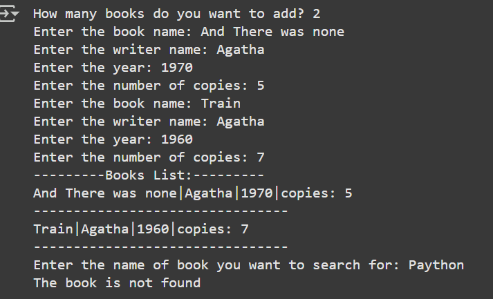
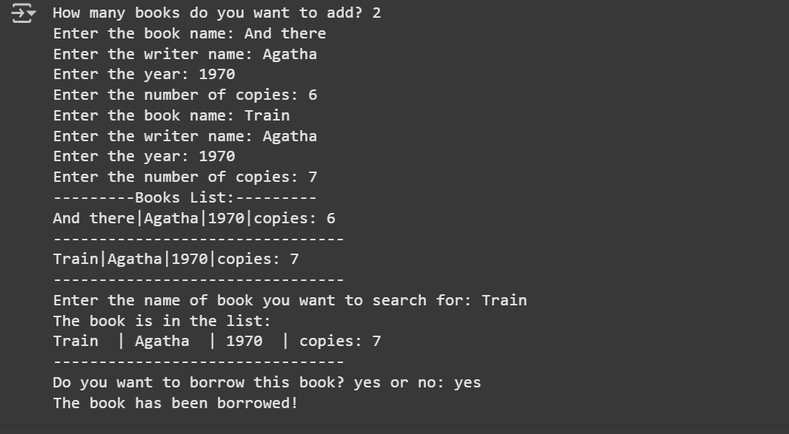

# Library Management System
This is a simple command-line Python program that simulates an electronic library system.  
It allows users to register books, display a catalog, search for books by title, and borrow available copies.

## Features
- Register multiple books with:
  - Title
  - Author
  - Publication Year
  - Available Copies
- Store data in lists (or dictionaries).
- Display a formatted catalog of all books.
- Search for books by title.
- Borrow a book if copies are available and update the inventory accordingly.

## Technologies
- Python (standard input/output)
- Data stored in memory (lists or dictionaries)
## Requirements

## Sample Run

## Sample Run2

## 🧠 Educational Purpose
This project was created to practice basic Python programming concepts such as loops, conditionals, functions, and working with structured data.

